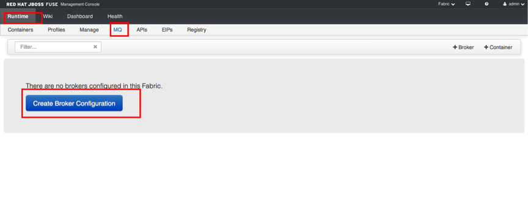
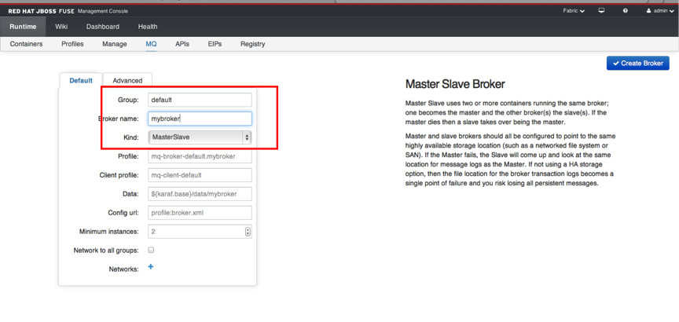
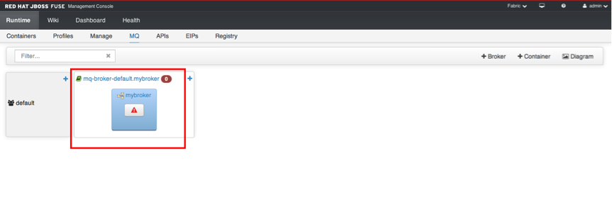
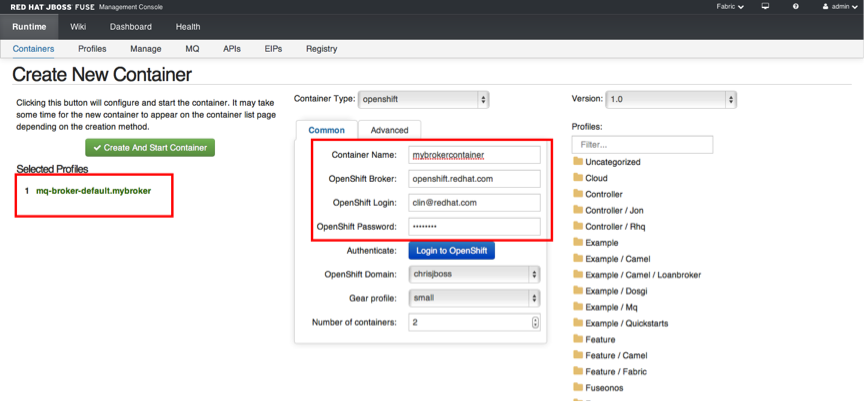
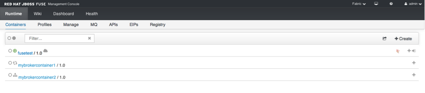
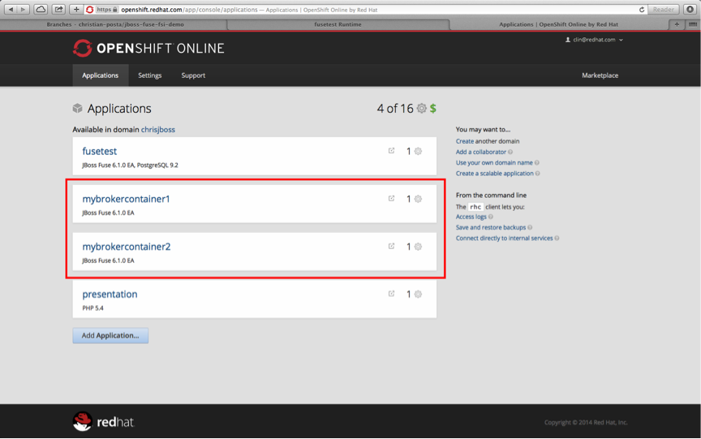
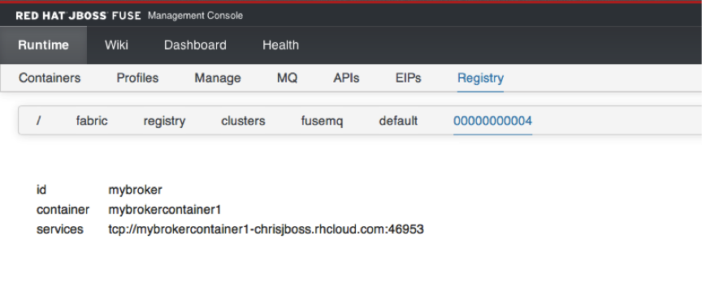
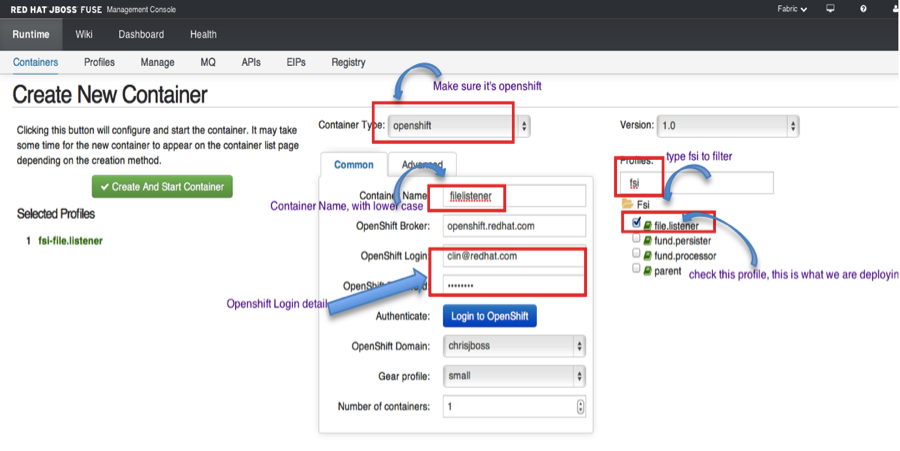
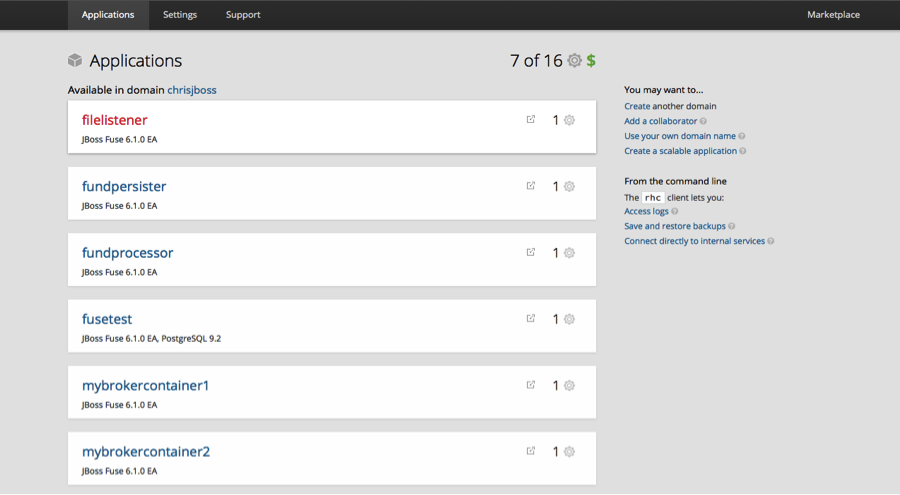

# A complete Fabric8/JBoss Fuse demo

The original project is by Christian Posta, you can find his original project here:
https://github.com/christian-posta/jboss-fuse-fsi-demo

So you want to see [Fabric8](http://fabric8.io)/[JBoss Fuse](http://www.jboss.org/products/fuse/overview/) in action, aye? Well I just demo'd this and thought, what the hell, let's spend a few more minutes making it so anyone can re-create this as a starting point. So here goes!

BTW, we're using [JBoss Fuse 6.1](http://www.jboss.org/products/fuse/overview/) in this demo, but you can use the community version, [Fabric8](http://fabric8.io) as well.

First... you're asking what are we going to demo?

Ultimately, the focus is going to be on a full developer lifecycle + devops management. The scenario is this: we are
an investment bank and we manage people's investment funds. We are trying to modernize our infrastructure by utilizing
an event-driven architecture to process new funds when they get created. However, on of our business partners can't/won't
update their communication strategies, so we're stuck with trying to modernize within some constraints. 

First, as our business partners deliver new-fund information via FTP/filesystem, we have to watch a file location. If a 
new file gets dropped into that location, we need to consume it as fast as possible and publish the payload as a a 
"New Fund" event onto our messaging bus.

Next, we have two consumers, but don't want to constrain ourselves with the architectural decisions we make right now
as we can easily add additional systems that are interested in new-fund events. So we use a JMS Topic to distribute
the new-fund event and have our consumers independently consume this stream. One consumer is interested in "Global" 
funds so it can store it to a database, while the other consumer needs to do some basic transformations and put it
into a file directory.

Our basic flows look like this:

File Listener:

Fund Persisteer:

Fund Processor:

So we have these microservices that perform a "Single Responsibility" and participate in a event-driven architecture.
But now we need to deploy them, version, and manage the deployments somehow. At last, the business cannot make money
from our development efforts until the code is deployed so we need a consistent, automated, managed approach to deploying
our solutions. So that's where the "Fuse Fabric" or [Fabric8](http://fabric8.io) piece fits into the picture.

Before you begin, don't forget to 
## Setting up Broker

So let's get started.
Go to your Fuse management console on OpenShift, login. Go to Runtime/MQ and click on create a broker configuration

    
In the configuration page name your broker configuration name, if you don't have enough gear, make sure you change the minimum instance to 1.   

Wait for a few moments, you will see the configuration diagram shows up, click on the red triangle to create the container for the broker profile.

Fill in the Openshift login detail

Wait for 2 containers to start up, You will also see the container is created in OpenShift

Find out the service port setting of the broker by going back the main fabric console, and look it up in the Registry

### Build the profiles for the deployments

Make sure all 3 camel-context.xml in 3 projects has the correct activemq setting, with the IP and Port on the OpenShift and ID/PWD as well.

	<bean id="activemq" class="org.apache.activemq.camel.component.ActiveMQComponent" >     
		<property name="brokerURL" value=" tcp://mybrokercontainer1-chrisjboss.rhcloud.com:46953"/>     
		<property name="userName" value="admin"/>     
		<property name="password" value="zBdeAcWGy2Bd"/>   
	</bean>

We're going to use the [fabric8-maven-plugin](http://fabric8.io/gitbook/mavenPlugin.html) to create our profiles and upload the profiles to fabric so we can deploy applications. If you're not familiar with profiles, please see the JBoss Fuse documentation or the [community docs at the Fabric8 website](http://fabric8.io/gitbook/index.html).
You'll need to change a few things in order to deploy on OpenShift.
Go to ~/.m2/setting.xml add the id/password of your OpenShift Management Console.

	<servers>
				....
    		<server>       
				<id>fabric8.openshift.repo</id>       
				<username>admin</username>       
				<password>xxxx</password>     
	</server>    

In pom.xml of the parent directory, Make sure the plugins are configured with the Jolokia Url, setting it to your OpenShift hostname:  http://apname-namespace.rhcloud.com/jolokia
	
	<plugin>         
		<groupId>io.fabric8</groupId>         
		<artifactId>fabric8-maven-plugin</artifactId>    
		<version>${fabric8.version}</version> 		
		<configuration>           
		<jolokiaUrl>http://fusetest-chrisjboss.rhcloud.com/jolokia</jolokiaUrl> 
		</configuration>       
	</plugin>

    
Then you can navigate to the root of the source (this project source) and run this command:

    mvn fabric8:deploy
    
This will use the fabric8-maven-plugin to create the profiles and upload them to JBoss Fuse.

Now click the "Wiki" tab of the JBoss Fuse webconsole and you should see the _fsi_ profiles got 
properly pushed to the Fabric registry:

The wiki profiles are organized in a hierarchical tree structure, so we can see that the top-level profile name made it
but click the _fsi_ entry to expand it and see the rest of the profiles:

### Deploy the profiles to running containers

You can now click back to the "Runtime" tab to get a list of all the containers in our Fabric. At the moment, there really
should be only one container, the _root_ container:

Off to the top right, you should see a "Create" icon. Click that to create a new container:

Now you need to assign a name, and chose a profile that will be applied to this container. See this guide:

Then click the "Create And Start Container button" If everything went okay, you should see your new container:

Now repeat this for the other two profiles, fund.persister and fund.processor You should end up with a list
of containers like this:

How easy was that!? We just deployed our solution as three separate microservices running in their own separate OpenShift Container just
by clicking a couple links! You should see what else JBoss Fuse8 can do with this model, like dynamic runtime discovery, load balancing, master/slave election, versioning, incremental upgrades, rollbacks, and much more!!

So, to exercise this demo, we'll need to exercise the file-listener module. And we know that module listens at a location on the file system for files. Well yes, but guess what.. With JBoss Fuse you can package up sample messages to include alongside your profiles (think of "smoke testing" with known good messages). And sure enough, we included some sample
messages. Go to the Wiki, select the fsi/file.listener profile. You should see a little data folder in the profile listing:

You should click that Data folder, then the input folder after that, and you should see the messages available for testing.
Clikc the _message1.xml_ file:

Sweet! Now we know this message is available to us in the profile, let's connect up to the container that has this profile deployed. We will then use this message and send it to the _file:_ input that Camel is listening on:
 

 
We should be taken to the container perspective of our _filelistener_ container within HawtIO:

After you've sent it, navigate back to the route itself:

WooHoo! It worked! Can you see the "1" on the diagram. This means one message was processed through this route.
Now take a look at the fact that it should have gone to the message broker, right? And subsequently, to the
microservices listening to the topic. Let's make sure:

Go back to the root container, and change the perspective from "Fabric" to "Container". Choose the container 
perspective. 

You should click on the "ActiveMQ" tab and expand the Topics:

Click the Topics top-level item and you should see this summary:

Awesome! What about the rest of our route? Use the same mechanism to log in to each container and click the
_Camel_ tab. Should see these diagrams:

Fund Persister:

Fund Processor:

What about the database, please go to fundpersister container, and you should see a log that prints out the current data in the fund table

### What else to Demo?
Well we kinda just scratched the surface. We should also show the Camel debugger, Camel Tracer, and Camel profiler. 
We should also show dynamic master/slave failover and the clients stay working. We could also show version changes and profile version sets and upgrade/rollback. We could also show the fabric:watch * and dev lifecycle/Rapid application deployment. Lots left to demo!

